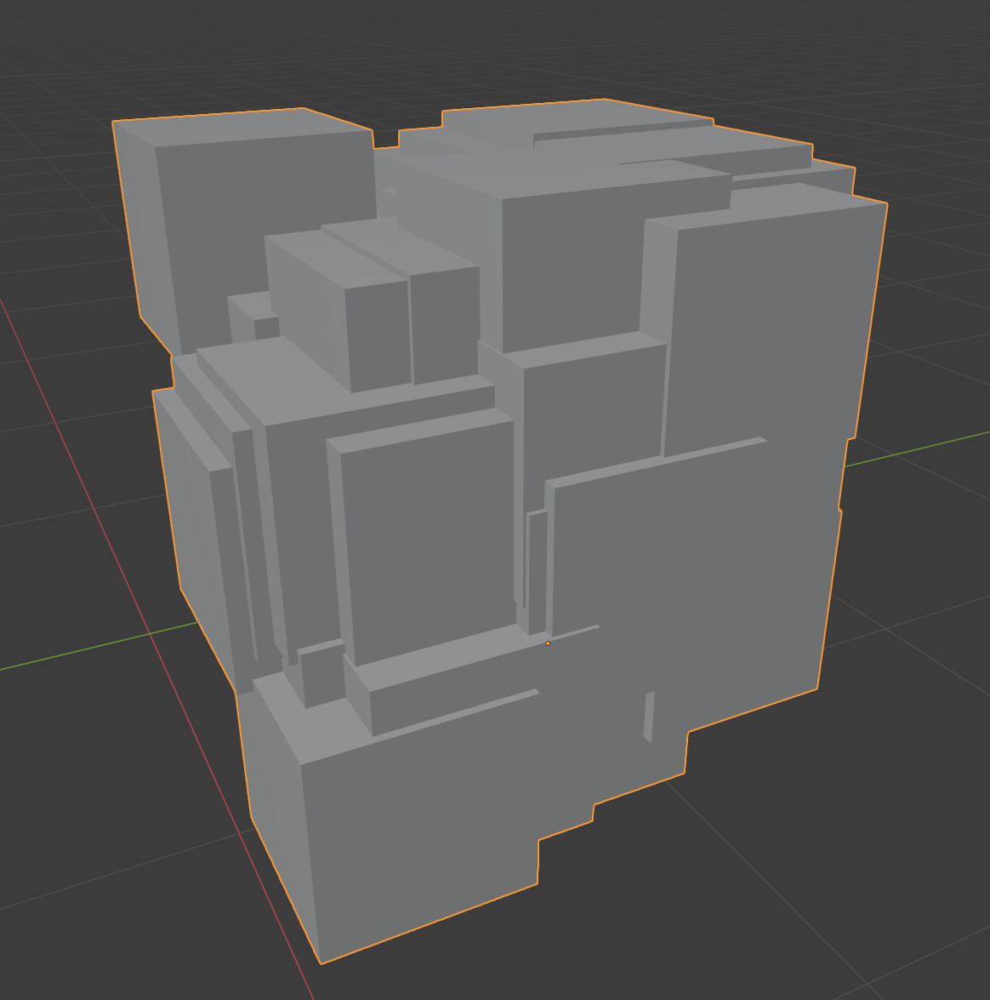
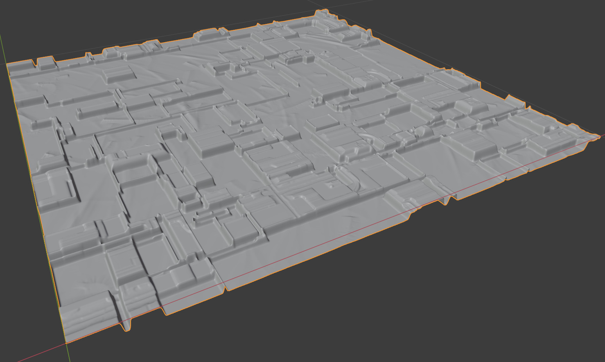
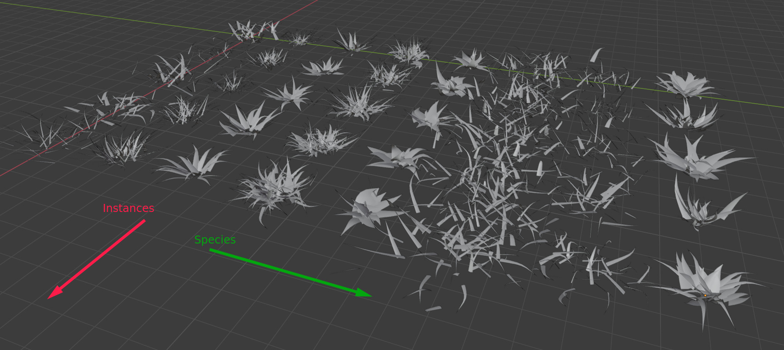
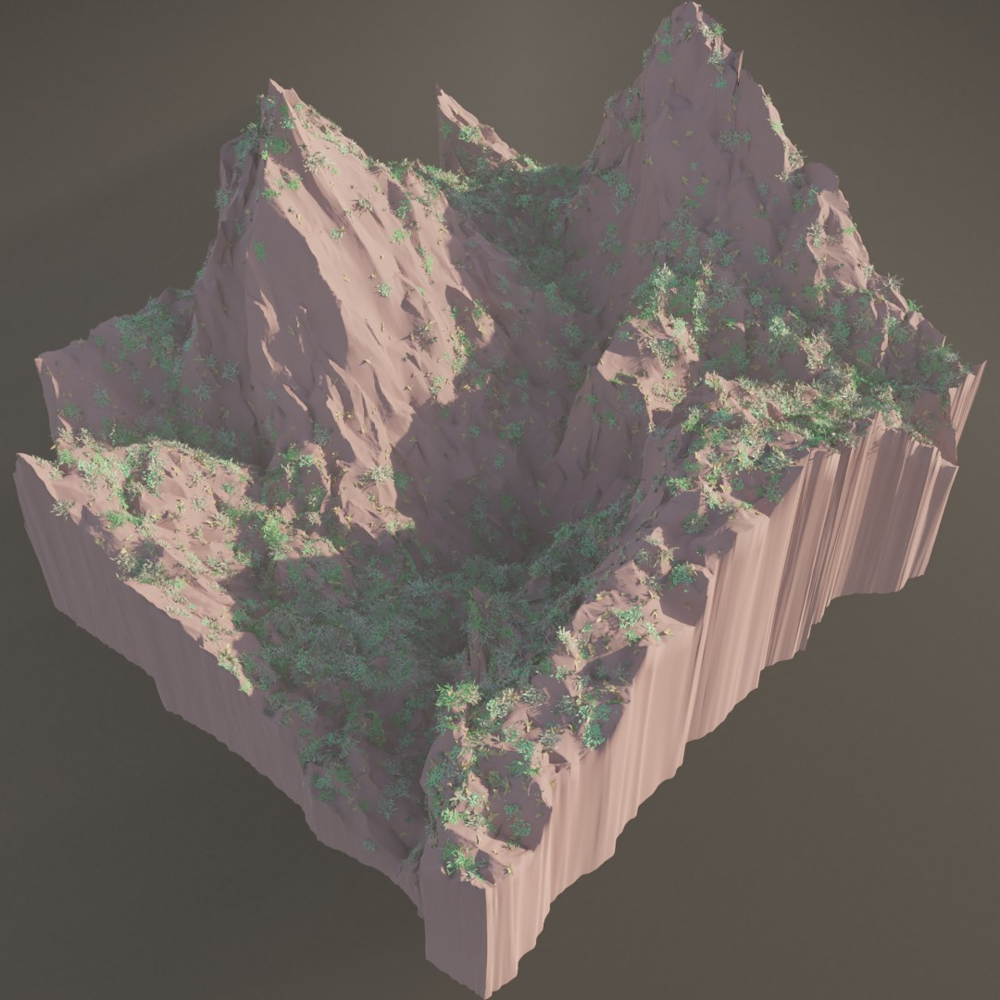

blendwr -- Convenient Blender Python API Wrappings
==================================================

Library for high-level graphics programming (e.g. procedural modelling), focused on 3D mesh processing. The main ideas
are to:

* provide an API that enables using blender python API without excessive amount of repeatable code
* wrap blender operators into functions so that context set-up is not necessary every time when they are called
* add some new, generic, convenient mesh processing utilities
* introduce new conventions of developing algorithms using blender API with few lines of clean code. See code examples
  below.

This API doesn't serve as a complete replacement for blender API, it is often necessary to use raw blender API along
with blendwr.

Tested with blender 2.93.2.

This is an initial version, and you can expect some changes in the future that won't be backward-compatible.

Requirements
------------
A required python package is `numpy`. `opencv-python` is an optional requirement
(e.g. for [displace_with_image.py](examples/displace_with_image.py) example). Keep in mind that depending on how blender
is compiled, it may either use system or shipped python executable (and therefore package install paths). You can check
python path used by blender in a following way:

```bash
blender --background --python <( echo "import sys;print(sys.executable)" )
```

How to use
----------
This section only describes a recommended (not required) approach.

### Developing algorithms using blender API (with or without blendwr)

A straightforward approach is to develop standalone python scripts, and run them in a following way:

```bash
blender --background --python my_script.py -- $my_script_arguments
```

Probably more convenient approach is to develop algorithms as
[addons](https://docs.blender.org/manual/en/latest/advanced/scripting/addon_tutorial.html). This approach enables boh
convenient debugging in blender with GUI, and running scripts that use addons in the background:

```bash
blender --addons my_addon,some_other_addon --background --python my_script_calling_addons.py -- $my_script_arguments
```

On top of that you can easily run your algorithms in dockerized way using
[these docker images](https://github.com/nytimes/rd-blender-docker) as base.

### How to use blendwr

For now this repository is recommended to be used as a submodule (e.g. git submodule) for blender scripts/addons.
Function names and parameters are meant to be self-explainatory for anyone familiar with either raw blender python API
or simply with blender software (GUI) usage. For first steps, study examples in sections below.


Simple Code Examples (<20 lines of code)
---------------

[scatter_cubes.py](examples/scatter_cubes.py) | [simple_terrain.py](examples/simple_terrain.py) | [displace_with_image.py](examples/displace_with_image.py)
:---:|:------:|:--------:
   |   | 

More Complex Code Examples (<300 lines of code)
---------------------

### Procedural grass (~100 lines of code)

This is the exact algorithm that is used in
my [Complex Environment Generator](https://www.artstation.com/artwork/Ye1r5X):

[examples/grass.py](examples/grass.py)



### Render-ready terrain with grass scatter (~200 + ~100 (grass) lines of code):

This algorithm generates a render-ready scene:

[examples/terrain_scatter.py](examples/terrain_scatter.py)




License note
------------

This repository is released on the MIT license, so that you have more freedom when using some code fragments without
using blender. Note that when you use it together with blender, it likely becomes infected with the GPL license -- this
repository won't function as a workaround to avoid the possible infection.

Why I am publishing this
------------------------

I create complex geometry generators using blender + python. After years of experiments, I think that blender + python
can be better than Houdini for procedural modeling that contains a lot of randomization on various steps -- houdini
graphical language is simply not suitable for handling diversity of geometry from previous generation steps. To develop
complex procedural algorithms it is at least useful to have:

1. A convenient mesh processing API
2. Full access to python libraries (like numpy and OpenCV)
3. Convenient version control (which is not the case in graphical languages)
4. Ability to run dockerized version on remote machines for fast feedback after editions

This API attempts to enable an environment where all these advantages are possible at once.

Check out [my ArtStation portfolio](https://www.artstation.com/msypetkowski)
for all my current and future CG projects. I have decided to make this generic base of my algorithms open-source.

Below are some renderings from my projects based on blendwr
(you can read about them in details on my portfolio)
that are not currently published.


