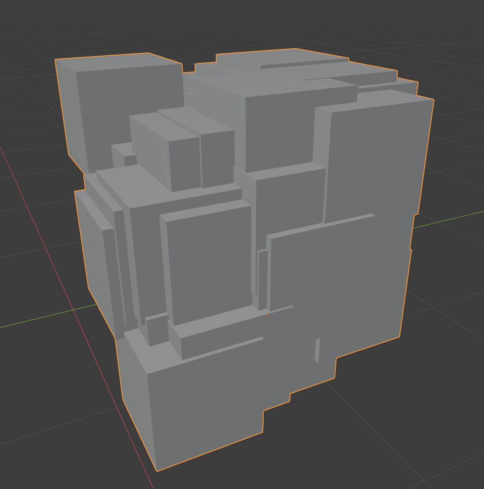
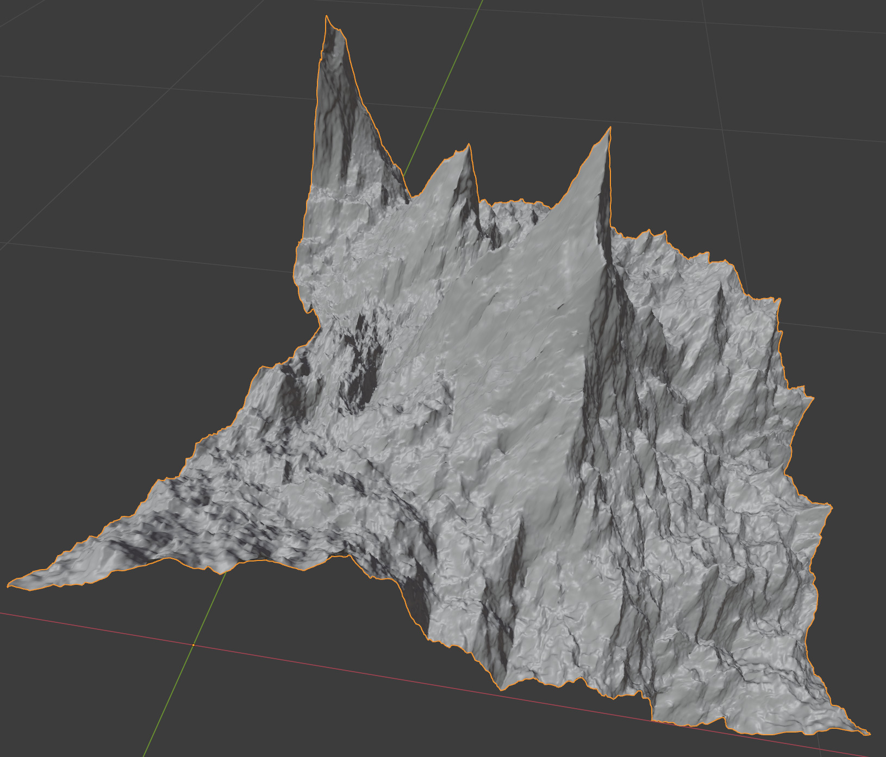

blendwr -- convenient blender API wrappings
===========================================

Library for high-level graphics programming (e.g. procedural modelling).
The main ideas are to:
* provide an API that enables using
blender API without excessive amount of repeatable code
* wrap blender operators
into functions so that context set-up is not necessary
every time when they are called
* add some new, generic, convenient functions

This is an initial version, and you can expect some changes in the future
that won't be backward-compatible.

Requirements
------------
See `requirements.txt` for required python libraries.
For now this repository is intended to use as a submodule for blender addons.
Tested with blender 2.93.0 Alpha, only tested on Linux.

Simple Examples
---------------

```python
def splatter_cubes(seed, n=50):
    import random
    from blendwr import edit as blwr_edit
    from blendwr import object as blwr_obj

    base_obj = blwr_obj.create_empty_mesh()
    with blwr_edit.EditMesh(base_obj) as editor:
        editor.make_box((.5, .5, .5))

    rand = random.Random(seed)
    cubes = []
    for _ in range(n):
        cubes.append(blwr_obj.duplicate(base_obj))
        blwr_obj.translate(cubes[-1], [rand.random() for _ in range(3)])

    blwr_obj.remove(base_obj)
    ret = blwr_obj.join(*cubes)
    ret.name = 'splattered_cubes'
    return ret
```



```python
def simple_terrain(seed, detail_levels=9, height_multiplier=.4):
    import random
    from blendwr import edit as blwr_edit
    from blendwr import object as blwr_obj

    rand = random.Random(seed)
    obj = blwr_obj.create_empty_mesh()
    with blwr_edit.EditMesh(obj) as editor:
        editor.bm.faces.new([editor.bm.verts.new(co + [0]) for co in [[0, 0], [0, 1], [1, 1], [1, 0]]])
        for detail_level in range(detail_levels):
            editor.select_all()
            editor.subdivide()
            editor.deselect_all()
            editor.select(rand.sample(list(editor.bm.verts), k=len(editor.bm.verts) // 3))
            scale = 2 ** (-detail_level)
            editor.translate([*[rand.uniform(-scale / 5, scale / 5) for _ in range(2)],
                              height_multiplier * scale])

    blwr_obj.shade_smooth(obj)
    return obj
```



Why I am publishing this
------------------------

I create complex geometry generators using blender + python.
After years of experiments,
I think that blender + python can be better than Houdini
for procedural modeling that contains a lot of randomization on various steps
-- houdini graphical language is simply not suitable for that.

Check out [my ArtStation portfolio](https://www.artstation.com/msypetkowski)
for all my current and future CG projects.

I have decided to make this generic base of my algorithms open-source.

Below are some renderings from my projects
(you can read about them in details on my portfolio)
that are not currently published,
but they all heavily rely on this repository.


